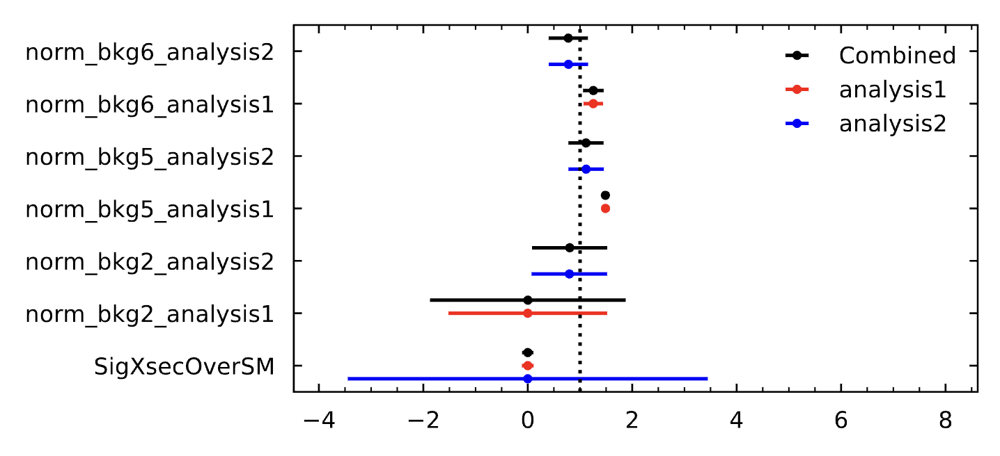
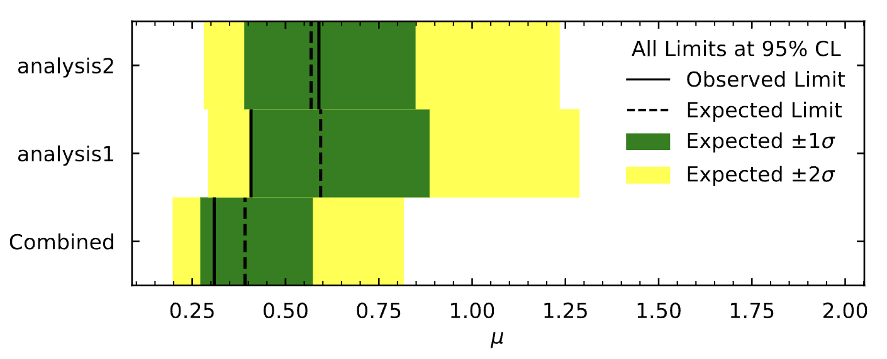

# SimpleCombination

Combine statistically independent workspaces without writing complicated code. SimpleCombination is based on the pyhf and cabinetry Python packages and allows providing configurations for individual inputs and the combination in an easily extendible format. An overview of the usage and the available command-line arguments is given below.

```
usage: combine.py [-h] -a ANALYSIS_NAMES [ANALYSIS_NAMES ...] [-p PARAMETERS [PARAMETERS ...]] [-c COMBINATION_NAME] [-o OUTPUT_DIR] [--output-level OUTPUT_LEVEL] [--ranking] [--fit-comparisons]

optional arguments:
  -h, --help            show this help message and exit
  -a ANALYSIS_NAMES [ANALYSIS_NAMES ...], --analyses ANALYSIS_NAMES [ANALYSIS_NAMES ...]
                        Whitespace-separated list of analyses to combined.
  -p PARAMETERS [PARAMETERS ...], --parameters PARAMETERS [PARAMETERS ...]
                        Whitespace-separated list of key-value pairs to be used as parameters.
  -c COMBINATION_NAME, --combination COMBINATION_NAME
                        Name of combination to perform.
  -o OUTPUT_DIR, --output-dir OUTPUT_DIR
                        Directory to store output in.
  --output-level OUTPUT_LEVEL
                        Output level for printing logging messages. 10: DEBUG, 20: INFO, 30: WARNING, 40: ERROR, 50: CRITICAL (default: 20).
  --ranking             Set flag to obtain ranking plot.
  --fit-comparisons     Set flag to run fits for individual analyses and compare with combined results.
```

## Configuration

Configurations for individual analyses are provided as classes inheriting from the abstract base class `AnalysisBase`. Examples can be found in the `analyses/` folder.
Similarly, combination-specific configurations are provided in a class inheriting from the abstract base class `CombinationBase`, for which examples can be found in the `combinations/` folder.
For example, to combine the workspaces belonging to `analysis1` and `analysis2` in `combination3` run

```
python combine.py -a analysis1 analysis2 -c combination3
```

which will load the settings for the individual analyses and for the combination.

### Analyses

Details on analysis-specific configuration can be found in the corresponding [README](analyses/README.md).


### Combinations

Details on combination-specific configuration can be found in the corresponding [README](combinations/README.md).

## Outputs

Results of the combined fit are written to `<output_dir>/fit_results.txt`. Visualisations of the fit model and the fit results are provided in the form of standard `cabinetry` plots of the modifier grid, of the pulls, and of the correlations between nuisance parameters. In addition, values for free-floating normalisation factors obtained from the combined fit are compared to the individual fit results in the `normfactor` plot.



A comparison of limits obtained from the combination with the limits obtained from the individual analyses is provided in the `limitcomparison` plot.



## Contributors

- Volker Austrup (ATLAS, University of Manchester)

- Mahsana Haleem (ATLAS, Julius Maximilian University Würzburg)

- Patrick Rieck (ATLAS, New York University)